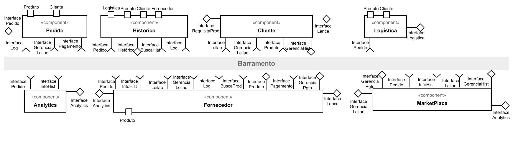
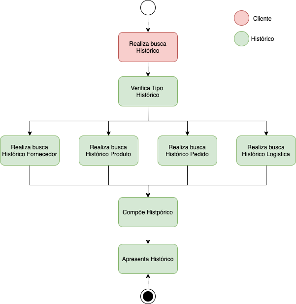
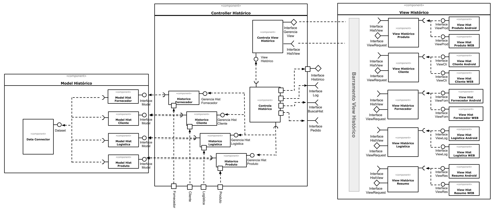
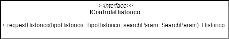
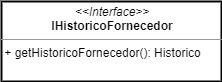
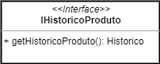
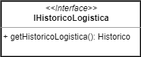
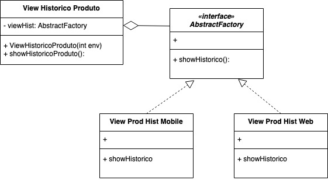

# Projeto Final
Projeto Final de conclusão da disciplina INF331 - Componentização e Reuso de Software: Conceitos e Práticas (2020)

# Projeto `<Título>`

# Equipe
*   Agner Esteves Ballejo
*   Ian Poli Tavares
*   José Eduardo Porte
*   Mateus Gonçalves Geracino
*   Marcos Vinícius Piaia
*   Tatiany Fermino Rodrigues de Oliveira

# Nível 1

Segue aqui uma arquitetura geral dos componentes que compões o sistema de um market place com foco nos cenários de Gestão de Fornecedores:

## Diagrama Geral do Nível 1

Segue o diagrama do mesmo:

### Detalhamento da interação de componentes

O detalhamento deve seguir um formato de acordo com o exemplo a seguir:

* O `componente X` inicia o leilão publicando no barramento a mensagem de tópico "`leilão/<número>/início`" através da interface `Gerente Leilão`, iniciando um leilão.
* O `componente Y` assina no barramento mensagens de tópico "`leilão/+/início`" através da interface `Participa Leilão`. Quando recebe uma mensagem…

Para cada componente será apresentado um documento conforme o modelo a seguir:

## Componente `<Nome do Componente>`

> <Resumo do papel do componente e serviços que ele oferece.>

**Interfaces**

> * Listagem das interfaces do componente.

As interfaces listadas são detalhadas a seguir:

## Detalhamento das Interfaces

### Interface `<nome da interface>`

> Resumo do papel da interface.

**Tópico**: `<tópico que a respectiva interface assina ou publica>`

Classes que representam objetos JSON associados às mensagens da interface:

~~~json
<Formato da mensagem JSON associada ao objeto enviado/recebido por essa interface.>
~~~

Detalhamento da mensagem JSON:

Atributo | Descrição
-------| --------
`<nome do atributo>` | `<objetivo do atributo>`

## Exemplo

### Interface DadosPedido

Interface para envio de dados do pedido com itens associados.

**Tópico**: `pedido/{id}/dados`

Classes que representam objetos JSON associados às mensagens da interface:

~~~json
{
  "number": 16,
  "duoDate": "2009-10-04",
  "total": 1937.01,
  "items": {
    "item": {
       "itemid": "1245",
       "quantity": 1
    },
    "item": {
       "itemid": "1321",
       "quantity": 1
    }
  }  
}
~~~

Detalhamento da mensagem JSON:

**Order**
Atributo | Descrição
-------| --------
number | número do pedido
duoDate | data de vencimento
total | valor total do pedido
items | itens do pedido

**Item**
Atributo | Descrição
-------| --------
itemid | identificador do item
quantity | quantidade do item

# Nível 2

Considerando a arquitetura acima, optou-se por detalhar o componente `Historico` considerando suas interfaces `Historico` e `Pedido`

Este componente tem por objetivo gerenciar as diversas informações geradas pelo sistema e que contribuem para o processo de avaliação do Fornecedor, além de auxiliar no processo de compra pelo Cliente. Dessa forma, ele monitora o barramento de comunicação do sistema acomulando informações relativas aos Pedidos, incluindo revisões do cliente sobre os elementos envolvidos neste e informações do componente de Logística relativas à preparação, envio, entrega e observações sobre a logística do Pedido.

Esses dados são acessados via as Interfaces Histórico, BuscaHist e GerenciaHist buscando atender ao conjunto de atividades detalhado abaixo:

O Diagrama abaixo apresenta maiores detalhes sobre os elementos envolvidos neste componente.

## Diagrama do Nível 2

## Componente `Historico`

Este componente considera o seguinte fluxo de atividade em seus subcomponentes.

- Como visto no diagrama acima, o componente `Controla Historico` concentra os meios de comunicação com os demais elementos do sistema, sendo que ele implementa as interfaces:

  - `Historico`
  - `Log`
  - `BuscaHist`
  - `Peidido`

  Com isso, o componente `Historico` assina os seguintes tópicos

  1. **`log/*`**
  2. **`pedido/*`**
  3. **`buscahist/*`**

- Ao receber uma mensagem com o tópico `/log/*` as seguintes ações são realizadas

  - O Componente `Controla Historico` utiliza a interface `Gerencia Hist Log` para acessar o componente `Historico Logistica`
  - O Componente `Historico Logistica` utiliza a interface `Model` para acessar o controlador dos dados do sistema
  - O Componente `Model Hist Lgisitica` realiza as manipulações necessárias sobre os dados da mensagem recebida e via a interface `Dataset`, persiste essas informações
  - O Componente `Data Connector` gerencia a interface com o subsistema sendo usado para a persistência dos dados.

- Ao receber uma mensage com o tópico `/pedido/*` as seguintes ações são realizadas

  - O Componente `Controla Historico` seleciona as informações de Cliente e utiliza a interface `Gerencia Hist Cliente` para acessar o componente `Histórico Cliente` e faz o mesmo procedimento com as informações de Fornecedor e Produto, utilizando os componentes `Historico Fornecedor`e `Historico Produto`.
  - O Componente `Historico Cliente` utiliza a interface `Model` para acessar o controlador dos dados do sistema. O mesmo procedimento acontece com os componentes `Historico Fornecedor`e `Historico Produto` que também implementaram a interface `Model`.
  - O Componente `Model Hist Cliente` realiza as manipulações necessárias sobre os dados da mensagem recebida e via a interface `Dataset`, persiste essas informações. O mesmo acontecendo nos componentes `Model Hist Fornecedor` e `Model Hist Produto`.
  - O Componente `Data Connector` gerencia a interface com o subsistema sendo usado para a persistência dos dados.

- Ao receber uma mensagem com o tópico `/buscahist/*` o componente `Controla Historico` entende que um conjunto de informações está sendo requisitado do mesmo. Vale ressaltar que essa mensagem vem identificada com um UUID, apresentando o seguinte formado: `/buscahist/{uuid}/*`.
  Para o tratamento desta mensagem, as seguintes ações são realizadas.

  - O componente `Controla Historico` identifica as solicitações presentes na mensagem, separando as buscas referentes a Cliente, Fornecedor, Produto e Losgística.
  - O componente `Controla Historico` utiliza as interfaces:
    - `Gerencia Hist Cliente` para enviar a solicitação de informações de histórico de Clientes.
    - `Gerencia Hist Fornecedor` para enviar a solciitação de informações de histórico de Fornecedores.
    - `Gerencia Hist Produto` para enviar a solicitação de informações de histórico de Produtos.
    - `Gerencia Hist Logistica` para enviar a solicitação de informações de Logística
  - Cada um dos seguintes componentes:
    -  `Historico Fornecedor` utiliza a Interface `Model` para obter e tratar os dados do componente `Model Hist Fornecedor` e retornar a informação desejada ao componente `Controla Historico`
    -  `Historico Cliente` utiliza a Interface `Model` para obter e tratar os dados do componente `Model Hist Cliente` e retornar a informação desejada ao componente `Controla Historico`
    -  `Historico Produto` utiliza a Interface `Model` para obter e tratar os dados do componente `Model Hist Produto` e retornar a informação desejada ao componente `Controla Historico`
    -  `Historico Logistica` utiliza a Interface `Model` para obter e tratar os dados do componente `Model Hist Logistica` e retornar a informação desejada ao componente `Controla Historico`
  - O Componente `Controla Historico` organiza a resposta à solicitação recebida
  - O componente `Controla Historico` realiza duas operações com essa informação
    - Utilizando a interface `Historico`, escreve no tópico **`/hist/{uuid}`** uma mensagem em resposta à solicitação recebida com esse **{uuid}** contendo as informações organizadas acima
    - Utilizando a interface `View Historico`, o componente `Controla View Historico` Iniciará o processo de exibição destes dados.
      - O componente Controla View Histórico utiliza a interface `Gerencia View` para acessar o barramento interno do componente usado para a interface com os demais componentes utilizados na visualização das informações.
        Estas. além disso, são repassadas pelo barramento utilizando os seguintes tópicos escritos pela interface `Gerencia View`.
        - **`resumo/*`** : tópico lido pela interface `HistView` implementada no componente `View Histórico Resumo`, o qual realiza a exibição dos dados solicitados como um resumo das informações.
        - **`log/*`** : tópico lido pela interface `HistView` implementada no componente `View Historico Logistica`, o qual apresenta os dados detalhados de eventos de "Logística" registrados no sistema para um determinado filtro informado na solicitação ao componente `Historico`
        - **`fornecedor/*`** : tópico lido pela interface `HistView` implementada no componente `View Historico Fornecedor`, o qual apresenta os dados detalhados dos eventos registrados para os Fornecedores presentes nos detalhes da solicitação enviada ao componente `Historico`
        -  **`cliente/*`** : tópico lido pela interface `HistView` implementada no componente `View Historico Cliente`, o qual apresenta os dados detalhados dos eventos registrados para os Clientes presentes nos detalhes da solicitação enviada ao componente `Historico`
        - **`produto/`**:  tópico lido pela interface `HistView` implementada no componente `View Historico Produto`, o qual apresenta os dados detalhados dos eventos registrados para os Produtos presentes nos detalhes da solicitação enviada ao componente `Historico`

  

  Segue abaixo um detalhamento de algumas interfaces consideradas acima.

## Detalhamento das Interfaces

### Interface `IControlaHistorico`

O objetivo dessa Interface é buscar o histórico seja ele de um Cliente, Fornecedor, Produto ou Logística e a mesma está localizada no `Controller Historico`

Método | Objetivo
-------| --------
`getHistorico` | Retorna um objeto do tipo Historico que contém o histórico de um Cliente, Fornecedor, Produto ou Logística

### Interface `IHistoricoCliente`

O objetivo dessa Interface é retornar o histórico de um Cliente e a mesma está localizada dentro do `Controller Historico`

Método | Objetivo
-------| --------
`getHistoricoCliente` | Retorna o histórico de um Cliente

### Interface `IHistoricoFornecedor`

O objetivo dessa Interface é retornar o histórico de um Fornecedor e mesma está localizada dentro do `Controller Historico`

Método | Objetivo
-------| --------
`getHistoricoFornecedor` | Retorna o histórico de um Fornecedor

### Interface `IHistoricoProduto`

O objetivo dessa Interface é prover o histórico de um Produto e a mesma está localizada dentro do `Controller Historico`

Método | Objetivo
-------| --------
`getHistoricoProduto` | Retorna o histórico de um Produto

### Interface `IHistoricoLogistica`

O objetivo dessa Interface é prover o histórico de um parceiro Logístico e a mesma está localizada dentro do `Controller Historico`

Método | Objetivo
-------| --------
`getHistoricoLogistica` | Retorna o histórico de um parceiro Logístico

# Multiplas Interfaces

​	Nesse ponto é interessante considerar dois elementos do componente `View Histórico`

- A interface com todos os componentes existentes nele é realizada via um Barramento Interno que trabalha com uma arquitetura de tópicos contendo mensagens em um protocolo definido de comunicação.
  Com isso, toda a interface do módulo de `Controller Historico` sempre acontece via esta estrutura de comunicação, de forma que, se um novo componente `View`poderia ser usado diretamente, desde que utilizasse a mesma arquitetura de troca de mensagens, implementando as interfaces `HistView` e `ViewRequest`

- A abordagem já considerada dentro do próprio componente `View Historico`, onde um componente consegue exibir seus dados utilizando multiplas interfaces.
  A idéia é utilizar uma implementação como a do padrão `Abstract Facotry`, exemplificada via o componente `View Historico Produto` abaixo

  

​	Com estas duas abordagens tratamos o possibilidade de variação dos componentes encapsulados no módulo `View`

