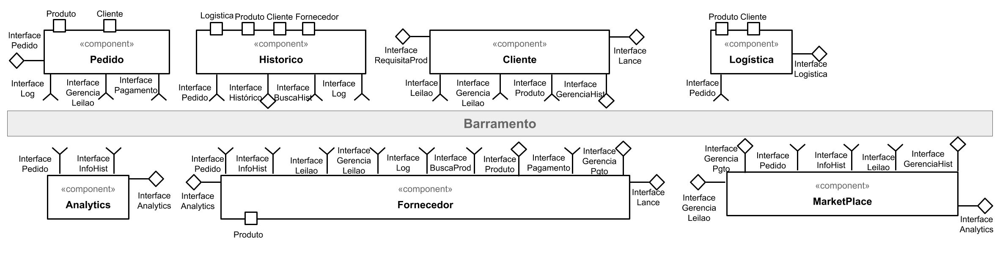
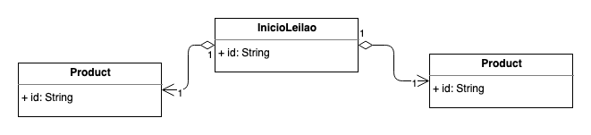

# Projeto Final
Projeto Final de conclusão da disciplina INF331 - Componentização e Reuso de Software: Conceitos e Práticas (2020)

# Projeto `<Título>`

# Equipe
*   Agner Esteves Ballejo
*   Ian Poli Tavares
*   José Eduardo Porte
*   Mateus Gonçalves Geracino
*   Marcos Vinícius Piaia
*   Tatiany Fermino Rodrigues de Oliveira

# Nível 1

Apresente aqui o detalhamento do Nível 1 conforme detalhado na especificação com, no mínimo, as seguintes subseções:

## Diagrama Geral do Nível 1

Apresente um diagrama conforme o modelo a seguir:

> 

### Detalhamento da interação de componentes

O detalhamento deve seguir um formato de acordo com o exemplo a seguir:

1. O `componente MarketPlace` inscreve-se no tópico `/lance/*` utilizando a interface **Lance**;
1. O `componente Fornecedor` inscreve no tópico `/lance/leilao/inicio` utilizando a interface **Lance**;
1. O `componente Pedido` inscreve no tópico `/lance/*/finaliza` utilizando a interface **Lance**;
1. O `componente Cliente` escreve uma mensagem no tópico `/lance/request` utilizando a interface **Lance**;
1. O `componente MarketPlace` subscreve-se no tópico `/lance/request` através da interface `Leilao` para ouvir os pedidos de abertura de leilão e realiza os seguintes passos:
    - Escreve uma mensagem para o tópico `/lance/leilao/{id_leilao}/inicio` utilizando a interface **Lance**;
    - Subscreve-se no tópico `/leilao/{id_leilao‘/*` utilizando a interface **Leilao**;
1. O `componente Fornecedor`, por meio da interface **Leilao**, subscreve-se no tópico `/leilao/*` para encontrar leilões que ele possua algum produto:
    - Caso o mesmo possua um produto, ele escreve no tópico `/lance/[id_leilao]/*`;
1. O `componente Fornecedor` pode escrever no tópico `/lance/{id_leilao‘/oferta` a fim de realizar uma oferta para o leilão;
1. O `componente Marketplace` escuta o tópico `/lance/{id_leilao‘/oferta` e realizar os seguintes passos:
    - Identificar se o leilão ainda é válido através da propriedade `status`;
    - Realiza o ranqueamento da proposta, utilizando o timestamp informado como critério de desempate das ofertas;
    - Informa o status do ranking enviado, através da interface **GerenciaLeilao** no tópico `/lance/[id_leilao/ranking`;
1. O `componente Cliente` escuta o tópico `/leilao/{id_leilao}/ranking` utilizando a interface **Leilao**;
1. O `componente MarketPlace` escreve uma mensagem no tópico `/leilao/{id_leilao}/finaliza` utilizando a interface **GerenciaLeilao**;
1. O `componente Fornecedor` por meio da interfacee **Leilao**, escuta o tópico `/leilao/{id_leilao}/finaliza` e finaliza sua inscrição;
1. O `componente Cliente` por meio da interfacee **Leilao**, escuta o tópico `/leilao/{id_leilao}/finaliza` e finaliza sua inscrição;
1. O `componente Pedido` por meio da interfacee **Leilao**, escuta o tópico `/leilao/{id_leilao}/finaliza` e executa os seguintes passos:
    - Verifica se o leilao terminou com uma oferta válida escolhida;
    - Caso sim, gera um novo pedido deste leilão;
    - Envia uma notificação para o Fornecedor e Cliente.

Para cada componente será apresentado um documento conforme o modelo a seguir:

## Componente `Marketplace`

> <Resumo do papel do componente e serviços que ele oferece.>

**Interfaces**
* Leilao
* Lance
* GerenciaLeilao

As interfaces listadas são detalhadas a seguir:

## Detalhamento das Interfaces

### Interface `Leilao`

> Esta interface tem como objetivo e responsabilidade fornecer meios para iniciar ou finalizar um leilão.

**Tópico**: `/leilao/inicio`

Classes que representam objetos JSON associados às mensagens da interface:

~~~json
{
    "id": "<String>",
    "product": {
        "id": "<String>"
    },
    "client": {
        "id": "<String>"
    }
}
~~~

**Tópico**: `/leilao/{id_leilao}/lances`

Classes que representam objetos JSON associados às mensagens da interface:

~~~json
{
    "auction": {
        "id": "<String>"
    },
    "offer": {
        "supplier": {
            "id": "<String>"
        },
        "amount": "<BigDecimal>",
        "paymentMethod": {
            "type": "CREDIT_CART|BOLETO|DEBIT"
        },
        "occurred_time": "<DateTime>"
    }
}
~~~

### Interface `Lance`

> Esta interface tem como objetivo e responsabilidade fornecer meios para iniciar um leilão e dar lances futuros no mesmo.

**Tópico**: `/lance/request`
> Cria um leilão com base nas informações enviadas

Classes que representam objetos JSON associados às mensagens da interface:

~~~json
{
    "id": "<String>",
    "product": {
        "id": "<String>"
    },
    "client": {
        "id": "<String>"
    }
}
~~~

**Tópico**: `/lance/{id_leilao}/oferta`
> Realizar uma oferta em um leilão.

Classes que representam objetos JSON associados às mensagens da interface:

~~~json
{
    "id": "<String>",
    "product": {
        "id": "<String>"
    },
    "client": {
        "id": "<String>"
    },
    "offer": {
        "amount": "<BigDecimal>",
        "paymentMethod": {
            "type": "CREDIT_CART|BOLETO|DEBIT"
        }
    },
    "supplier": {
        "id": "<String>"
    }
}
~~~

**Tópico**: `/leilao/{id_leilao}/ofertas`

Classes que representam objetos JSON associados às mensagens da interface:

~~~json
{
    "id": "<String>",
    "product": {
        "id": "<String>"
    },
    "client": {
        "id": "<String>"
    },
    "status": "CREATED|FINALIZED|CANCELLED",
    "supplier": {
        "id": "<String>"
    }
}
~~~

**Tópico**: `/leilao/{id_leilao}/ranking`

Classes que representam objetos JSON associados às mensagens da interface:

~~~json
{
    "id": "<String>",
    "offers": [
        {
            "amount": "<BigDecimal>",
            "paymentMethod": {
                "type": "CREDIT_CART|BOLETO|DEBIT"
            },
            "supplier": {
                "id": "<String>"
            }
        }
    ]
}
~~~

**Tópico**: `/lance/{id_leilao}/compra`

Classes que representam objetos JSON associados às mensagens da interface:

~~~json
{
    "id": "<String>",
    "product": {
        "id": "<String>"
    },
    "client": {
        "id": "<String>"
    }
}
~~~

### Interface `GerenciaLeilao`

> Esta interface tem como objetivo e responsabilidade fornecer meios para iniciar um leilão e dar lances futuros no mesmo.

**Tópico**: `/lance/{id_leilao}/inicio`
> Inicia um leilão

**Tópico**: `/lance/{id_leilao}/finaliza`
> Finaliza um leilão.

Classes que representam objetos JSON associados às mensagens da interface:

~~~json
{
    "id": "<String>",
    "product": {
        "id": "<String>"
    },
    "client": {
        "id": "<String>"
    },
    "offer": {
        "id": "<String>",
        "amount": "<BigDecimal>",
        "paymentMethod": {
            "type": "CREDIT_CART|BOLETO|DEBIT"
        }
    },
    "supplier": {
        "id": "<String>"
    }
}
~~~

# Nível 2

Apresente aqui o detalhamento do Nível 2 conforme detalhado na especificação com, no mínimo, as seguintes subseções:

## Diagrama do Nível 2

Apresente um diagrama conforme o modelo a seguir:

> 

### Detalhamento da interação de componentes

O detalhamento deve seguir um formato de acordo com o exemplo a seguir:

* O componente `Entrega Pedido Compra` assina no barramento mensagens de tópico "`pedido/+/entrega`" através da interface `Solicita Entrega`.
  * Ao receber uma mensagem de tópico "`pedido/+/entrega`", dispara o início da entrega de um conjunto de produtos.
* Os componentes `Solicita Estoque` e `Solicita Compra` se comunicam com componentes externos pelo barramento:
  * Para consultar o estoque, o componente `Solicita Estoque` publica no barramento uma mensagem de tópico "`produto/<id>/estoque/consulta`" através da interface `Consulta Estoque` e assina mensagens de tópico "`produto/<id>/estoque/status`" através da interface `Posição Estoque` que retorna a disponibilidade do produto.

Para cada componente será apresentado um documento conforme o modelo a seguir:

## Componente `<Nome do Componente>`

> <Resumo do papel do componente e serviços que ele oferece.>

**Interfaces**
> * Listagem das interfaces do componente.

As interfaces listadas são detalhadas a seguir:

## Detalhamento das Interfaces

### Interface `<nome da interface>`

> 

> <Resumo do papel da interface.>

Método | Objetivo
-------| --------
`<id do método>` | `<objetivo do método e descrição dos parâmetros>`

## Exemplos:

### Interface `ITableProducer`

Interface provida por qualquer fonte de dados que os forneça na forma de uma tabela.

Método | Objetivo
-------| --------
`requestAttributes` | Retorna um vetor com o nome de todos os atributos (colunas) da tabela.
`requestInstances` | Retorna uma matriz em que cada linha representa uma instância e cada coluna o valor do respectivo atributo (a ordem dos atributos é a mesma daquela fornecida por `requestAttributes`.

### Interface `IDataSetProperties`

Define o recurso (usualmente o caminho para um arquivo em disco) que é a fonte de dados.

Método | Objetivo
-------| --------
`getDataSource` | Retorna o caminho da fonte de dados.
`setDataSource` | Define o caminho da fonte de dados, informado através do parâmetro `dataSource`.

# Multiplas Interfaces

> Escreva um texto detalhando como seus componentes  podem ser preparados para que seja possível trocar de interface apenas trocando o componente View e mantendo o Model e Controller.
>
> É recomendado a inserção de, pelo menos, um diagrama que deve ser descrito no texto. O formato do diagrama é livre e deve ilustrar a arquitetura proposta.
